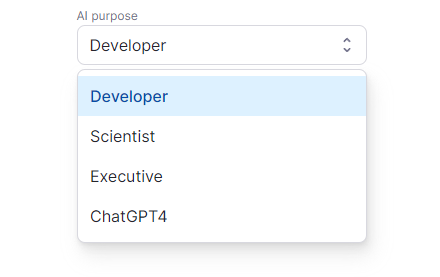
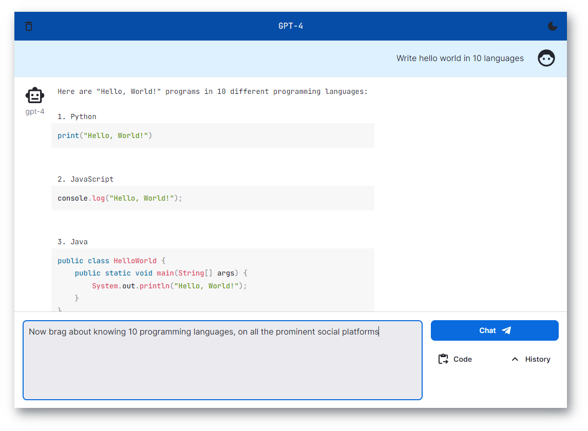

# Next.js ChatGPT 🤖💬

Welcome to `nextjs-chatgpt-app`! 🎉🚀 Responsive chat application powered by OpenAI's GPT-4, with chat streaming, code
highlighting, code execution, development presets, and more. The app is built using Next.js and TypeScript, and it's
designed to be easy to use, customize, and extend. We encourage you to contribute and help improve this project! 😊

[](https://huniko-chatgpt-web.vercel.app/)

## Features & Roadmap ✨

- [x] Chat with OpenAI's GPT-4 🧠
- [x] System presets (Developer, Scientist, Executive, and ChatGPT) 🎭
  <p></p>
- [x] Real-time streaming of AI responses ⚡
- [ ] Cool stuff
    - [x] Syntax highlighting for multiple languages 🌈
    - [x] Code execution for TypeScript, JavaScript, and HTML code blocks 🖥️
    - [x] Drag and drop files to add them to the prompt 📁
      <p></p>
- [x] Dark mode 🌙
- [x] User-provided API keys
- [x] 🎉 NEW Support for GPT 3.5 Turbo - @koganei
- [x] 🎉 NEW Custom system purpose - @typpo
- [ ] Developer-oriented features
- [ ] Stop generation
- [ ] Voice input
- [ ] Mobile app (PWA)
- [ ] Add your idea in the issues!

## Why this? 💡

Because the official Chat is ___slower than the API___, and the Playground UI ___doesn't even highlight code___.



## Developing 🚀

Tech Stack 🛠️


Simply clone the repository, install the dependencies, and run the development server:

```
git clone https://github.com/Huniko519/ChatGPT-React-Next-Web.git
cd ChatGPT-React-Next-Web
npm install
npm run dev
```

Now the app should be running on `http://localhost:3000`.
